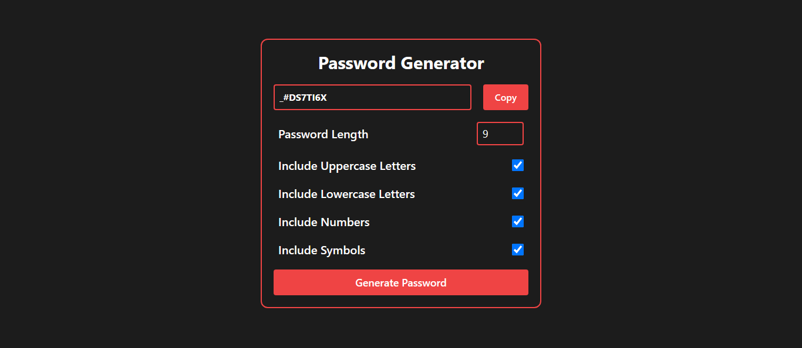

# 🔐 React Password Generator

A modern and customizable **Password Generator** built with **React.js** and styled using **Tailwind CSS**. Generate secure passwords with options like length, uppercase/lowercase letters, numbers, and symbols — all in a clean and responsive UI.

---

## 🌐 Live Demo

🔗 [Generate a Password](https://mubeen2005.github.io/password-generator/)  

---

## 🖼️ Preview

  

---

## 🧰 Tech Stack

- ⚛️ **React.js** – Frontend framework
- 💨 **Tailwind CSS** – Utility-first CSS framework
- 🔐 **JavaScript** – Password logic and clipboard handling
- 🧠 **useState, useEffect** – React hooks for state and logic

---

## ✨ Features

- ✅ Generate strong passwords
- 📏 Choose password length
- 🔡 Include:
  - Uppercase letters
  - Lowercase letters
  - Numbers
  - Special characters
- 📋 Copy password to clipboard with one click
- 📱 Fully responsive design (mobile-friendly)
- 💡 Clean and minimal UI
